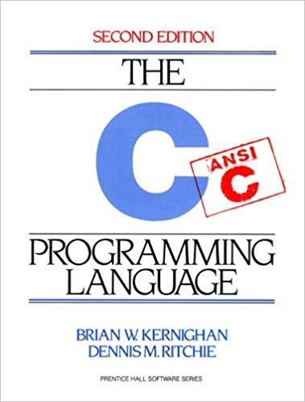

# TheCProgrammingLanguageExercises
Exercises from the C Programming Language by Brian Kernighan and Dennis Ritchie. For each exercise, I try to use only what we have learnt in the book up to that point, hence the multiple putchars in place of printfs in the first chapter.

